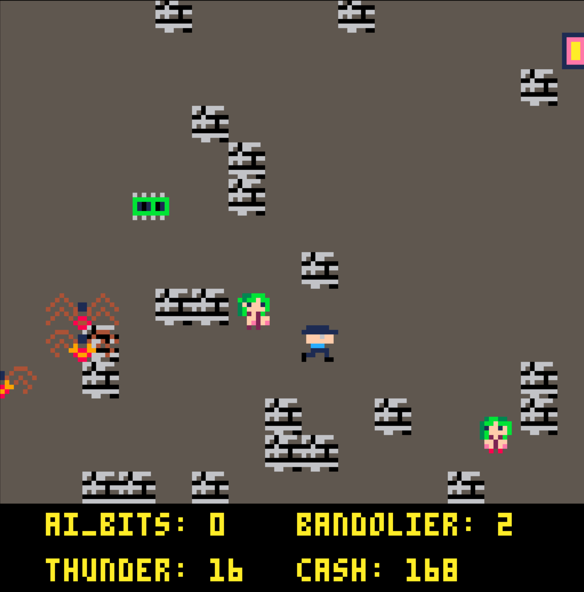

# j46k
j46k is a game made with [pico8](https://www.lexaloffle.com/pico-8.php).

In j46k you play as our favorite thrill seeking arachnipobe.  Fight baddies while collecting aibits to power your super computer which you can use for your nefarious plans to take over the world.



## Demo
You can play a current demo [here](https://dfirebaugh.itch.io/j46k)

### Controls
Use your keyboards arrow keys to move.
Action buttons are z and x on the keyboard.

## Contributing
Once you are setup with pico-8, launch pico8.

The folder command will open the directory that the carts exist in your file explorer.

```
folder
```

Once there, take note of the filepath.  In linux, this is typically ` ~/.lexaloffle/pico-8/`

Clone the repo and go back to pico-8.
Now you should be able to type in `ls` and see the repo.

```
cd j46k
load j46k.p8
run
```

This will launch the game.

You can use you standard text editor to edit the code.  However, when you go back to pico8, you will need to reload the game.  I usually do this with `ctrl+R`.
Note: there are no uppercase characters in pico-8

If you hit the `escape` key while the game is loaded, it will open up the pico8 editor.  Here you can edit code, make sprites, edit music, and sfx.

If you are working with an external text editor, you do run the risk of overwriting changes made in the pico-8 editor.  Make sure you save any changes you make in the pico-8 editor by pressing `ctrl+S` before returning to your text editor.

Note: There are several global variables in the cart.  This is because pico-8 players can easily press `esc` and hack away on the code.  It's intended for people to easily hack the game without much knowledge of the codebase.

### Pico-8 References
[The Pico-8 CheatSheet](https://www.lexaloffle.com/bbs/?tid=28207) is good for a quick reference.  Use the [wiki](https://pico-8.fandom.com/wiki/Pico-8_Wikia) for more in depth explanations.

[other resources](https://www.lexaloffle.com/pico-8.php?page=resources)

### TODOs
Pending tasks are being tracked in a [trello](https://trello.com/b/Y8psWTIU/j46k).
Let me know if you would like access to this.

A few items in the todo:

- Make a boss
- add some easter eggs
- add some power ups and abilities to help with the boss fight
- better orchestration on the boss fight
- discovery: help the player learn how to play
- title screen
- bugfixes
- improve secondary attack
- fix hitbox for spiders and trs80